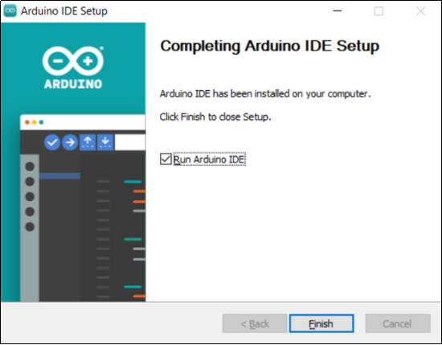
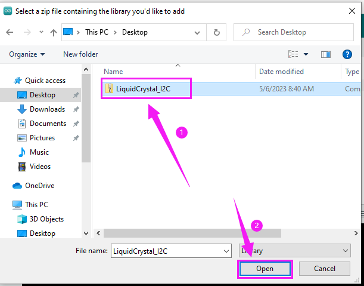

# Arduino开发板环境配置和驱动安装

**什么是 ARDUINO？**

Arduino是一个基于易于使用的硬件和软件的开源电子平台，适用于任何交互式项目制作.

**ARDUINO软件**

您可以通过用Arduino编程语言编写代码并使用Arduino开发环境.

## **1. 下载arduino IDE**

 **A. Windows系统**

Arduino IDE官网下载: [https://www.arduino.cc/](https://www.arduino.cc/)

进入官网点击**SOFTWARE**: 

下载适配您电脑的版本即可。

WINDOWS可选两种下载方式：直接下载应用（无需手动安装）或者下载压缩包文件（手动安装驱动）。 

点击 **JUST DOWNLOAD** 即可。

 **B. Mac系统**

请参考Windows:

下载完成后双击打开应用，根据提示安装。

 **C.安装**

1.保存.exe文件到硬盘驱动并执行。

2.阅读许可协议License Agreement，点击同意。

3.选择安装选项。

4.选择安装位置。

5.点击完成并运行。

## **2. 驱动安装**

开发板需要驱动启动，否则通信口无法使用。

选择对应的开发板和操作系统查看具体教程：
* CP2102
* CH340

| Sku | 开发板 |图片                      |           Windows           |         MAC         |
|:---: | :---------------:  | :------------------:    | :--------------------------------: | :------------------------: |
| | |   | [CP2102-WINDOWS](windowsCP2102.md) | [CP2102-MAC](MacCP2102.md) |
| | |   | [CP2102-WINDOWS](windowsCP2102.md) | [CP2102-MAC](MacCP2102.md) |
| | |  | [CP2102-WINDOWS](windowsCP2102.md) | [CP2102-MAC](MacCP2102.md) |
| | |  | [CP2102-WINDOWS](windowsCP2102.md) | [CP2102-MAC](MacCP2102.md) |
| | || [CP2102-WINDOWS](windowsCP2102.md) | [CP2102-MAC](MacCP2102.md) |
| | |  | [CH340-WINDOWS](windowsCH340.md)   |  [CH340-MAC](MacCH340.md)  |
| | | | [CH340-WINDOWS](windowsCH340.md)   |  [CH340-MAC](MacCH340.md)  |
| | | | [CP2102-WINDOWS](windowsCP2102.md) | [CP2102-MAC](MacCP2102.md) |
| | |  | [CH340-WINDOWS](windowsCH340.md)   |  [CH340-MAC](MacCH340.md)  |
| | | | [CP2102-WINDOWS](windowsCP2102.md) | [CP2102-MAC](MacCP2102.md) |

## **3. Arduino IDE 设置**

点击启用Arduino IDE.

1. 文件：新建项目，打开，关闭，保存，示例，另存为，首选项，高级设置...
2. 编辑：复制 ，剪切，粘贴，自动格式化，放大字体，减小字号...
3. 项目：验证，上传，导入库...
4. 工具：开发板，端口...
5. 帮助：检查更新，参考...
6. 串口绘图仪：折线图绘制串口数据
7. 串口监视器：打印串口数据
8. 验证代码
9. 验证上传代码
10.  项目文件夹：新建项目，登陆云端同步云项目
11. 开发板管理：安装、移除开发板
12. 库管理：安装、移除库
13. 调试：监视代码，调试断点
14. 搜索
15. 编辑项目区域
16. IDE输出：报告错误或成功上传，显示串口监视器数据

## **4. Arduino IDE上传代码**

**'/'：使用Keystudio Plus UNO作为教程的示例**

目前支持的开发板和操作系统教程
* UNO
* pico
* ESP32

| 开发板                        |               windows               |                 MAC                 |
| :---------------------------- | :---------------------------------: | :---------------------------------: |
| Keyes Plus UNO           | [Win Plus UNO Tutorial](win-UNO.md) | [Mac Plus UNO Tutorial](mac-UNO.md) |
| Keyes NANO               |                  /                  |                  /                  |
| Keyes MEGA 2560          |                  /                  |                  /                  |
| Keyes Leonardo           |                  /                  |                  /                  |
| Keyes Micro pro\por Mini |                  /                  |                  /                  |
| Keyes ESP32\ESP32 Plus   |   [Win ESP32 Tutorial](win-ESP32)   |   [Mac ESP32 Tutorial](mac-ESP32)   |
| raspberry pi pico             |    [Win Pico Tutorial](win-Pico)    |    [Mac Pico Tutorial](mac-Pico)    |

## **5. 导入库**

**注意：不同的开发板导入库的方法都类似，都可以参照下面的方法。**

 
 

首先，需要相应的Arduino库文件。

 **A. 什么是库文件?**

库是一个代码集合，以便轻松地连接传感器、显示器、模块等。

例如，内置的LiquidCrystal库可以帮助与LCD显示器通信。

互联网上还有数百个库可供下载。参考资料中列出了内置库和其中一些附加库。

如果在编译或上传代码时出现“No such file or directory”错误，则表示库文件缺失。如下图所示，由于缺少“LiquidCrystal_I2C”库文件，上传LCD1602模块代码时发生错误。

 **B. 怎样导入库?**

以"LiquidCrystal_I2C"为例。

进入项目，导入库，添加zip库。

找到需要导入的库文件，上传并等待安装成功。

**动图示例**

导入库的方法对于两种操作系统来说大同小异。

其他资源，请关注官网：[https://www.keyes_robot.com/](https://www.keyes_robot.com/)

## **6.其它主板**

树莓派Pico
[WINDOWS](%E6%A0%91%E8%8E%93%E6%B4%BEPico.md#a-windows)
[MAC](%E6%A0%91%E8%8E%93%E6%B4%BEPico.md#b-mac)

ESP32主板
[WINDOWS](ESP32%E4%B8%BB%E6%9D%BF.md#a-windows)
[MAC](ESP32%E4%B8%BB%E6%9D%BF.md#b-mac)

