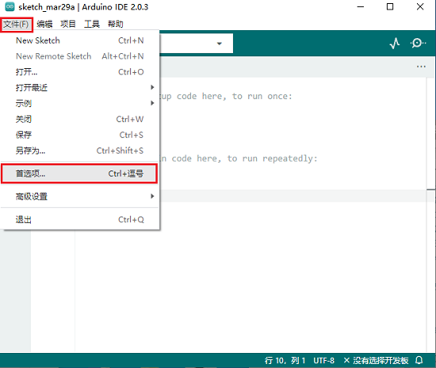
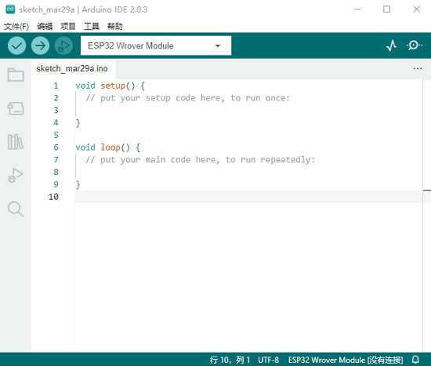
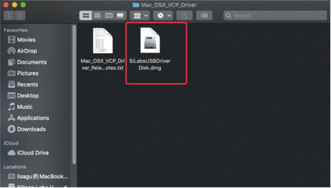
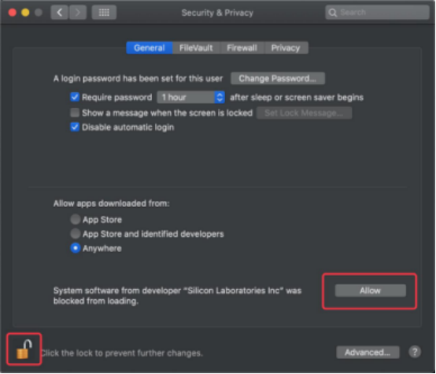
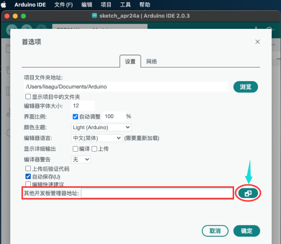
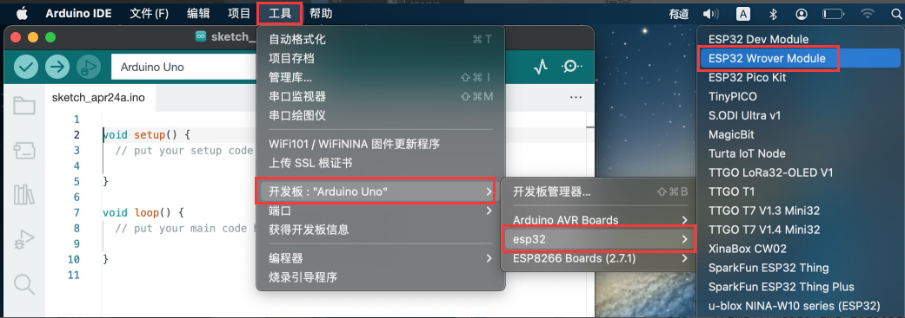

# **ESP32开发板环境配置和驱动安装：**

注意：Arduino IDE 软件的下载，安装与设置方法和上面的一样，就不重复说明了。

 
 

(相关资讯：[https://github.com/earlephilhower/arduino-esp32](https://github.com/earlephilhower/arduino-esp32) )

## **A. Windows系统**

**1. 在Arduino IDE上安装ESP32：**

上面已经学习了怎么下载，安装Arduino IDE 软件和怎么安装驱动，那下面就要在Arduino IDE上安装ESP32，请执行以下步骤：

特别注意：你需要Arduino IDE 1.8.5或更高版本才能在其上安装ESP32。

(1)点击电脑桌面上的图标，打开Arduino IDE。

(2)点击“文件” →“首选项”，如下图：

(3)打开下图标出的按钮。

(4)将这个地址：https://dl.espressif.com/dl/package_esp32_index.json ，复制粘贴到里面去再点击“**确定**”保存这个地址，如下图：

(5)再点击“**确定**”。

（6）先点击“**工具**”→“**开发版:**”，再点击“**开发版管理器...**”进入“**开发版管理器**”页面，在文本框中输入“**esp32**”，选择最新版本进行安装，安装包不大，点击“**安装**”开始安装相关安装包。如下图。

（7）点击“**工具**”→“**开发版:**”，就可以看到安装好的ESP32 Arduino，你可以在里面查看到各种不同型号ESP32开发板，选择对应的ESP32开发板型号。

（8）设置好板型后，再选择正确的COM口（安装驱动成功后可看到对应COM口），设置如下图。

## B. Mac系统:

1.下载安装Arduino IDE:

进入Arduino官方网站：[https://www.arduino.cc/](https://www.arduino.cc/) ，点击“**SOFTWARE**”进入下载页面，如下图所示：

2.如何安装CP2102驱动程序：

（注意：如果已经安装了驱动程序，则不需要再安装驱动；如果没有，则需要进行以下操作）

（1）用USB线将ESP32主板连接到你的MacOS系统电脑上，并打开Arduino IDE。

（2）CP2102驱动下载链接：
https://cn.silabs.com/developers/usb-to-uart-bridge-vcp-drivers?tab=downloads

（3）点击下载MacOS 版本。

（4）解压下载好的压缩包。

（5）打开文件夹，双击“SiLabsUSBDriverDisk.dmg”文件。

可以看到以下文件。

（6）双击“Install CP210x VCP Driver”，勾选“Don’t warn me when opening application on this disk image”并单击“Open”。

（7）单击“Continue”。

（8）先点击“Agree”，然后点击“Continue”。

（9）继续点击“Continue”，然后输入你的用户密码。

（10）选择“Open Security Preferences”。

（11）点击安全锁，输入你的用户密码来授权。

（12）看到锁被打开了，点击“Allow”。

（13）回到安装界面，根据提示等待安装。

（14）安装成功。

3. 在Arduino IDE上安装ESP32：
上面已经学习了怎么下载ArduinoIDE和怎么安装驱动，那下面就要在Arduino IDE上安装ESP32，请执行以下步骤：

特别注意：你需要Arduino IDE 1.8.5或更高版本才能在其上安装ESP32。

(1)点击电脑桌面上的图标，打开Arduino IDE。点击“Arduino IDE” →“首选项”，如下图：

(2)打开下图标出的按钮。

(3)将这个地址：https://dl.espressif.com/dl/package_esp32_index.json ，复制粘贴到里面去再点击“**确定**”保存这个地址，如下图：

(4)再点击“**确定**”。

（5）先点击“**工具**”→“**开发版:**”，，再点击“**开发版管理器...**”进入“**开发版管理器**”页面，在文本框中输入“**esp32**”，选择最新版本进行安装，安装包不大，点击“**安装**”开始安装相关安装包。如下图。

（6）点击“**工具**”→“**开发版:**”，就可以看到安装好的ESP32 Arduino，你可以在里面查看到各种不同型号ESP32开发板，选择对应的ESP32开发板型号。

（7）设置好板型后，再选择正确的COM口（安装驱动成功后可看到对应COM口），设置如下图。

