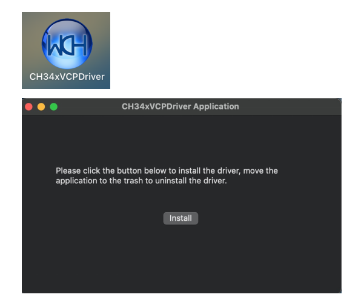
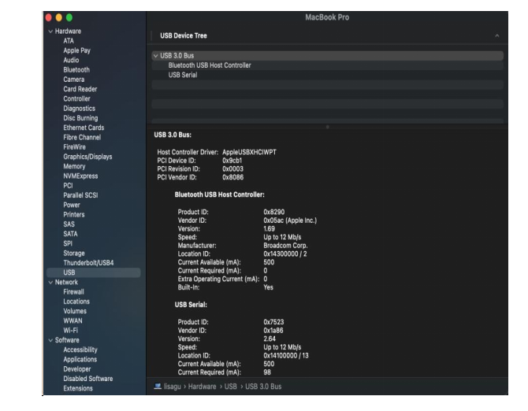

# **CH340驱动安装--MAC**

**1**: 从网站下载驱动，解压缩到本地安装目录。

**2**: 说明驱动默认为pkg格式，请参见步骤3。如果OS X 11.0及以上版本不支持Rosetta，请参考步骤4安装dmg驱动程序。

安装前，请转到“系统偏好设置”->“安全与隐私”->“常规”页面，在标题“允许从:下载应用程序”下面选择选项2 ->“Mac应用程序商店和识别的开发者”，然后驱动程序将正常工作。

**3**: 如果要安装pkg格式的驱动程序，点击驱动文件→继续→安装

安装成功。

在OS X 11.0及以上版本安装pkg格式驱动程序:打开“LaunchPad”→“CH34xVCPDriver”→“install”。

当使用OS X 10.9到OS X 10.15时，请单击“重新启动”重新启动计算机，重新启动后请执行以下步骤。

**4**: 安装dmg驱动，点击dmg文件，拖拽“CH34xVCPDriver”进入操作系统的应用文件夹。

打开“LaunchPad”→“CH34xVCPDriver”→“Install”。

安装成功。

将CH340主控板插入USB接口时，请打开“系统报告->硬件->USB”。右侧为“USB设备树”。如果USB设备工作正常，您将发现其“供应商ID”为[0x1a86]的设备。

打开“应用程序-实用程序”文件夹下的“终端”程序，键入命令“ls /dev/tty*”。

你将会看到“tty。wchusbserialx”，其中“x”是分配的设备号，类似于Windows COM端口分配。

