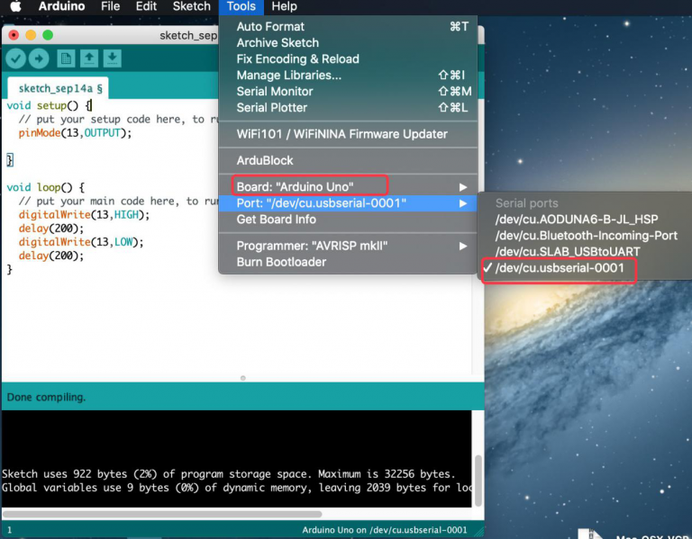
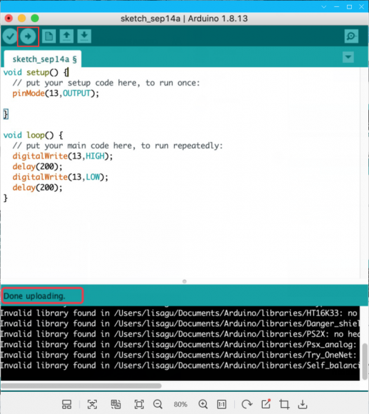
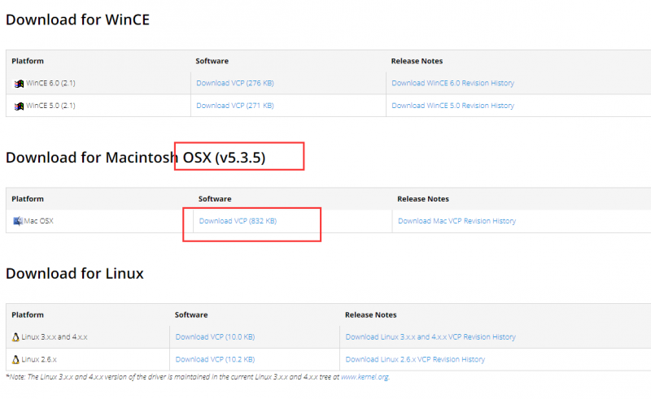
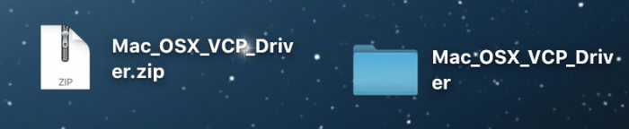
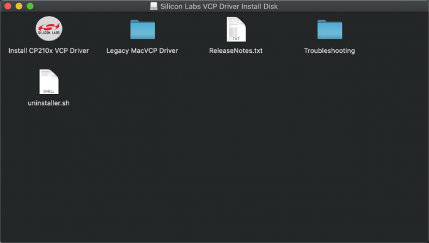
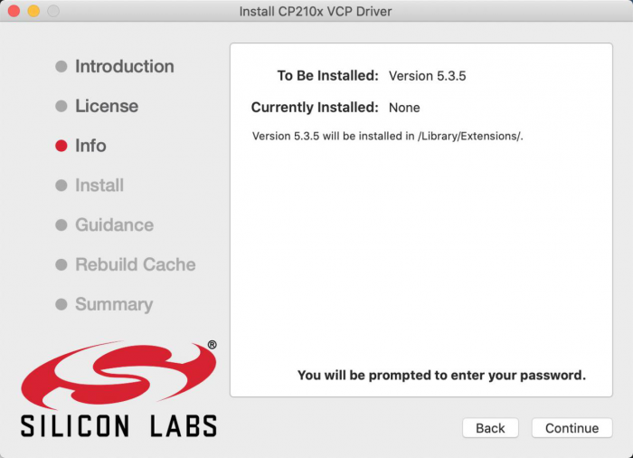
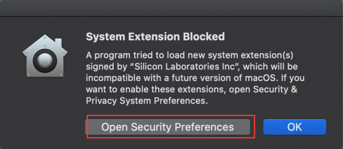
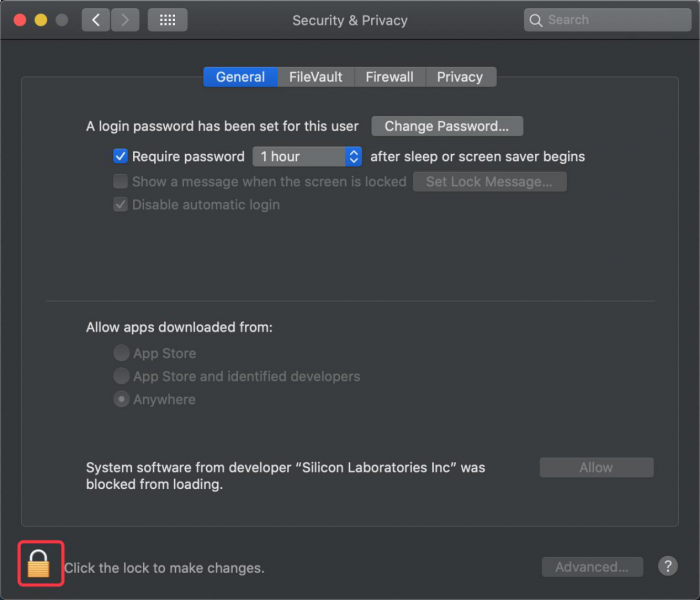
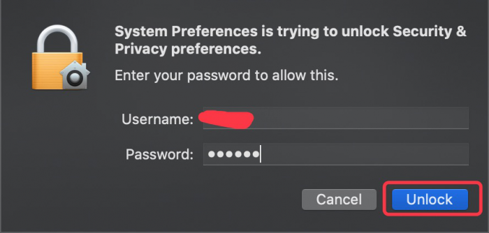
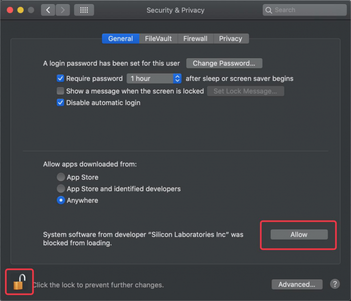

# **CP2102驱动安装--MAC**

将我们提供的主板连接到您的计算机上，打开Arduino IDE。

点击“工具”选择**Board: Arduino Uno**中的**Port: /dev/cu.usbserial-0001**。

点击  上传代码，如果刻录成功，您将看到完成上传。

注意:如果刻录不成功，需要安装CP2102驱动程序，请继续按照以下说明:

下载CP2102驱动:[https://www.silabs.com/products/development-tools/software/usb-to-uart-bridge-vcp-drivers](https://www.silabs.com/products/development-tools/software/usb-to-uart-bridge-vcp-drivers)

1\. 选择Mac OSX

2\. 解压

3\. 双击打开SiLabsUSBDriverDisk.dmg.

4\. 你将会看到：

5\. 双击“安装CP210x VCP驱动程序”，勾选“不警告我”，点击“打开”。

6\. 继续

7\. 继续并同意

8\. 继续，输入你的密码

9\. 选择开放安全首选项

10\. 点击锁定解锁安全和隐私偏好。

11\. 允许

12\. 等待安装

13\. 安装完成

14\. 然后进入ArduinoIDE，点击工具，选择开发板: Arduino Uno and /dev/cu.SLAB_USBtoUAPT

15\. 点击 上传代码，显示“完成上传”。

