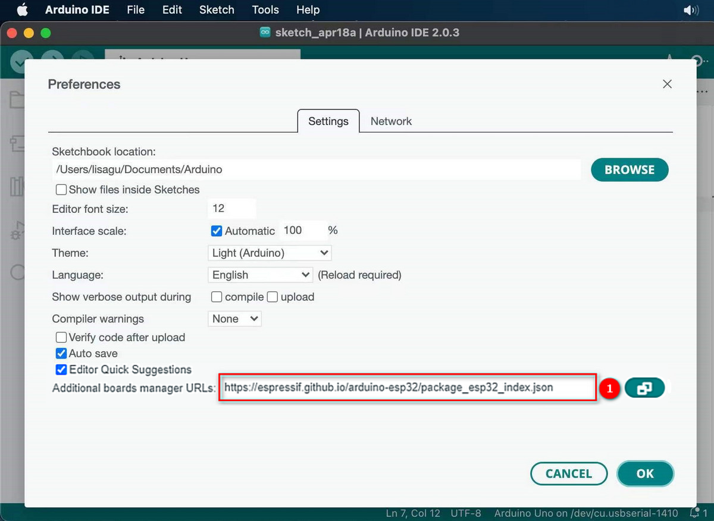

# **ESP32开发板--MAC**

通常情况下，我们无法在工具中的开发板中找到ESP32板。因为我们还没有在Arduino IDE上安装这个板。


安装步骤：

打开Arduino IDE，进入首选项。

复制ESP32板链接（https://espressif.github.io/arduino-esp32/package_esp32_index.json)并粘贴到其他开发板管理器地址。



打开开发板管理器


搜索并安装最新版ESP32， 等待安装完成。

**安装过程中，请确保网络稳定。如果失败，请再次操作上一步重新安装。**


安装完成后，选择开发板类型。


选择通信端口。

如果端口太多，你不知道哪个是正确的，你可以拔下板，看看哪个消失了。如果没有COM口，请检查驱动是否安装。

点击工具，端口并选择“/dev/cu.usbderial-0001”.


如果连接成功，页面会有提示。

现在您可以尝试上传代码了。这里提供了一个示例代码：每秒打印一次“Hello keystudio !”。


复制粘贴以下代码到Arduino IDE: 

```c
/*
  keyestudio 
  打印 “Hello Keyestudio!”
  http://www.keyestudio.com
*/
void setup() { 
    Serial.begin(9600);  //设置波特率为9600
}

void loop() { 
    Serial.println("Hello Keyestudio!");  //打印信息
 	delay(1000);  //延时1s
}
```

点击 编译，成功编译后显示：


上传时如果显示 “————……..————……..”，请长按开发板上的启动按钮（仅适用于Keyestudio ESP32开发板 ，其中不包含Keyestudio Plus ESP32）。

点击  设置波特率为9600， 串口打印 “Hello Keyestudio!”。


1. 切换自动滚动：设置是否跟随打印。
2. 显示时间戳：设置是否显示打印时间。
3. 清除输出：清除输出数据。
4. 串行输入
5. 串口发送格式
6. 波特率：设置波特率。
7. 打印窗口

现在请为IDE导入库，否则会出现错误。

