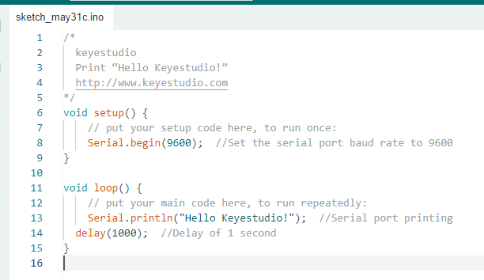
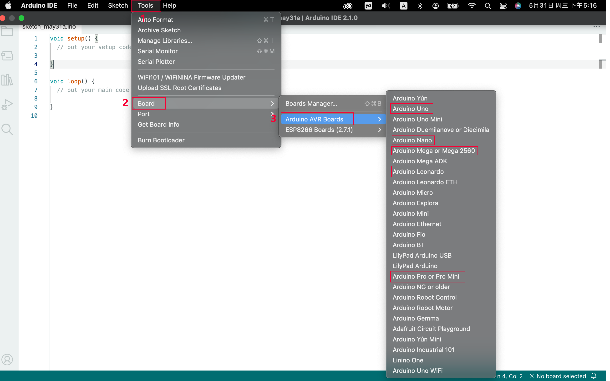
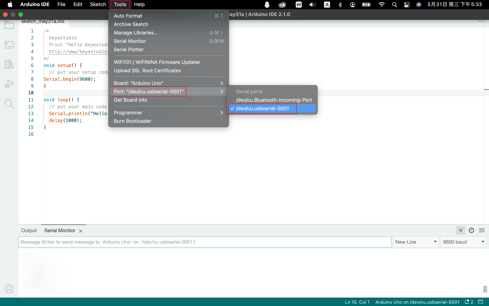
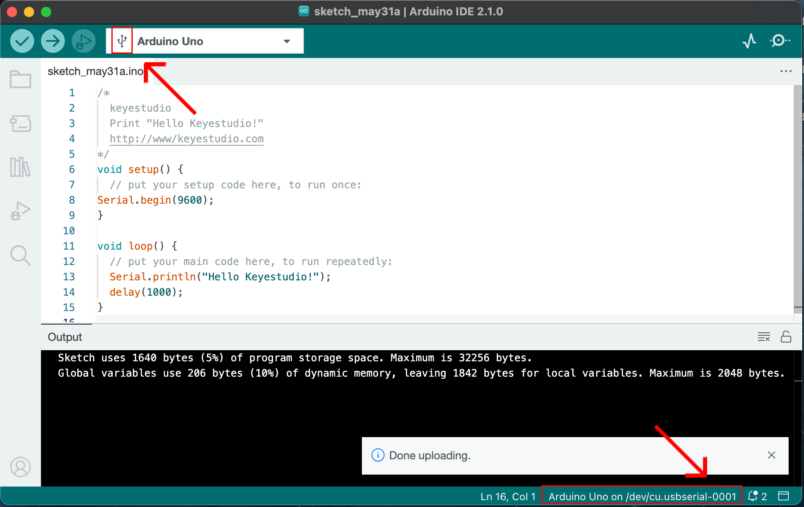
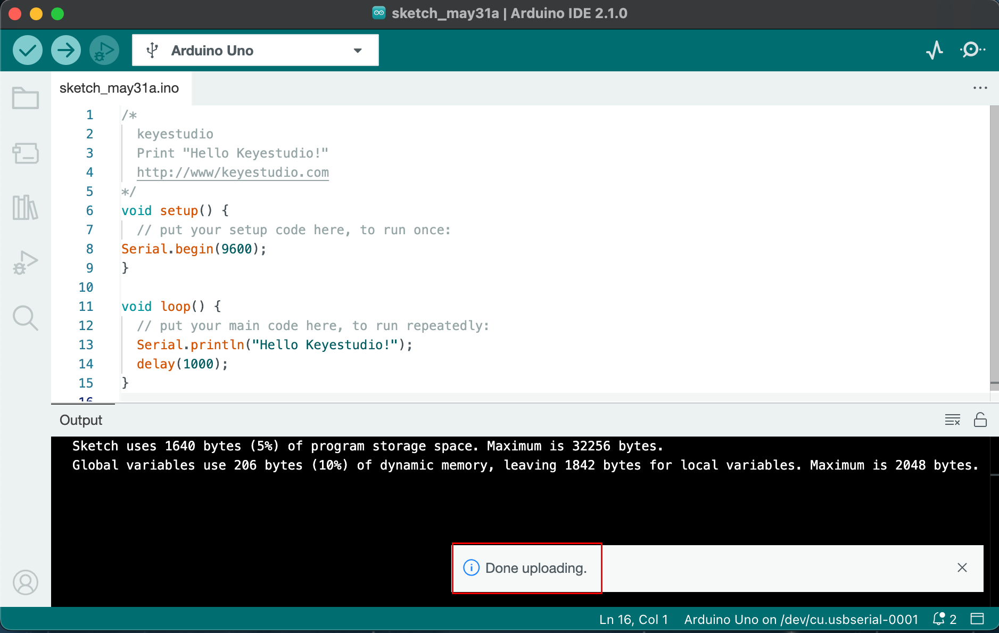
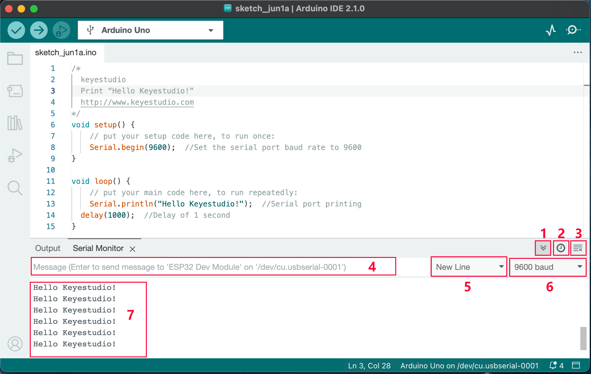

# **UNO开发板--Mac**

上传代码：这里提供了一个示例代码，每秒打印一次“Hello keystudio !”

将以下代码复制粘贴到Arduino IDE中

```c
/*
  keyestudio 
  打印 “Hello Keyestudio!”
  http://www.keyestudio.com
*/
void setup() { 
    Serial.begin(9600);  //设置波特率为9600
}

void loop() { 
    Serial.println("Hello Keyestudio!");  //打印信息
 	delay(1000);  //延时1s
}
```



点击工具，开发板，选择Arduino AVR Boards中的Arduino Uno。



选择通信口。

如果有太多的端口，你不知道哪个是正确的，你可以拔下板，看看哪个消失了。如果没有COM口，请检查驱动是否安装。

点击工具，端口，选择“/dev/cu.usbderial-0001”.



安装成功后将会收到提示。



点击 编译。 



点击 设置波特率为9600，串口打印“Hello Keyestudio!” 。



1. 切换自动滚动：设置是否跟随打印。
2. 显示时间戳：设置是否显示打印时间。
3. 清除输出：清除输出数据。
4. 串行输入
5. 串口发送格式
6. 波特率：设置波特率。
7. 打印窗口

现在请为IDE导入库，否则会出现错误。


