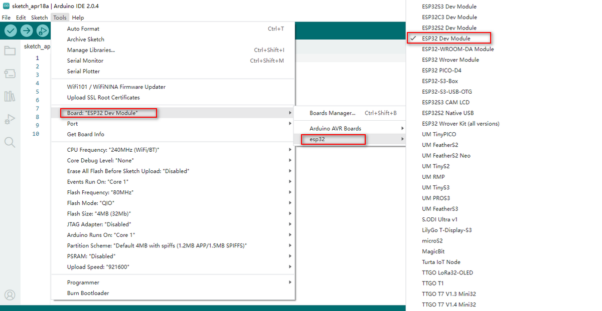

# **ESP32开发板--Windows**

通常情况下，我们无法在工具中的开发板中找到ESP32板。因为我们还没有在Arduino IDE上安装这个板。


安装步骤：

打开Arduino IDE，进入首选项。

复制ESP32板链接（https://espressif.github.io/arduino-esp32/package_esp32_index.json）并粘贴到其他开发板管理器地址。


打开开发板管理器


搜索并安装最新版ESP32， 等待安装完成。

**安装过程中，请确保网络稳定。如果失败，请再次操作上一步重新安装。**


安装完成后，选择开发板类型。



选择通信端口。

如果端口太多，你不知道哪个是正确的，你可以拔下板，看看哪个消失了。如果没有COM口，请检查驱动是否安装。


此处我们的通信口是 COM3， 因此我们在端口中选择 “COM3”


如果连接成功，页面会有提示。现在您可以尝试上传代码了。这里提供了一个示例代码：每秒打印一次“Hello keystudio !”。

```c
/*
  keyes 
  打印 “Hello keyes!”
  http://www.keyes_robot.com
*/
void setup() { 
    Serial.begin(9600);  //设置波特率为9600
}

void loop() { 
    Serial.println("Hello keyes!");  //打印信息
 	delay(1000);  //延时1s
}
```


点击 编译上传代码。


上传时如果显示 “————……..————……..”，请长按开发板上的启动按钮（仅适用于keyes ESP32开发板 ，其中不包含keyes Plus ESP32）。

点击 设置波特率为9600， 串口打印 “Hello keyes!”。


1. 切换自动滚动：设置是否跟随打印。
2. 显示时间戳：设置是否显示打印时间。
3. 清除输出：清除输出数据。
4. 串行输入
5. 串口发送格式
6. 波特率：设置波特率。
7. 打印窗口

现在请为IDE导入库，否则会出现错误。


