# **Pico开发板--Windows**

通常情况下，我们无法在工具中的开发板中找到Pico板。因为我们还没有在Arduino IDE上安装这个板。

安装步骤：

启动Arduino IDE， 进入:

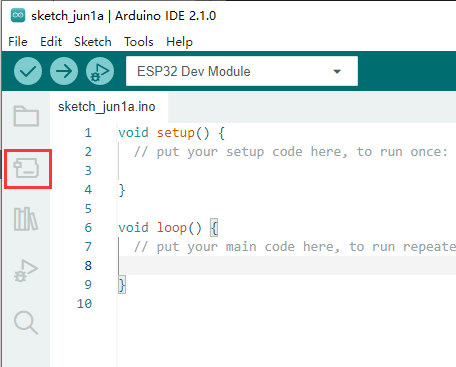

搜索**Pico**并安装 **Arduino Mbed OS RP2040 Boards**. 

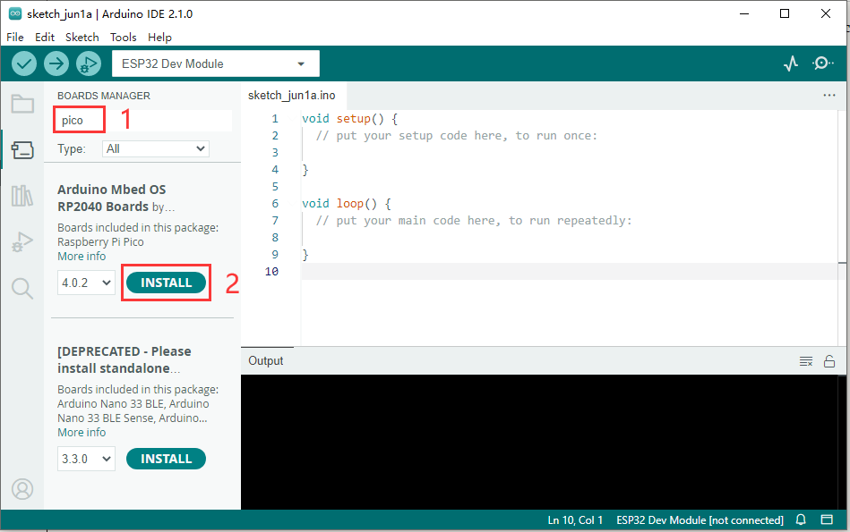

出现安全页面，点击安装即可。

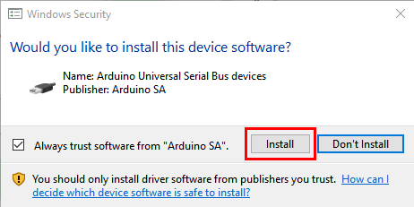

安装完成会有弹出窗口提示

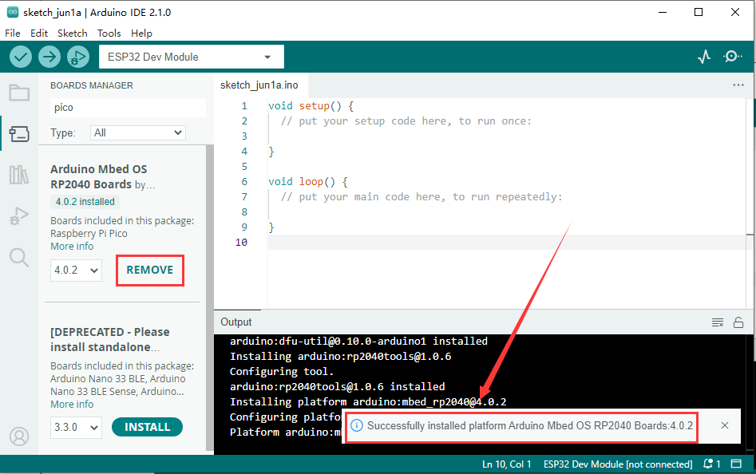

选择pico板。

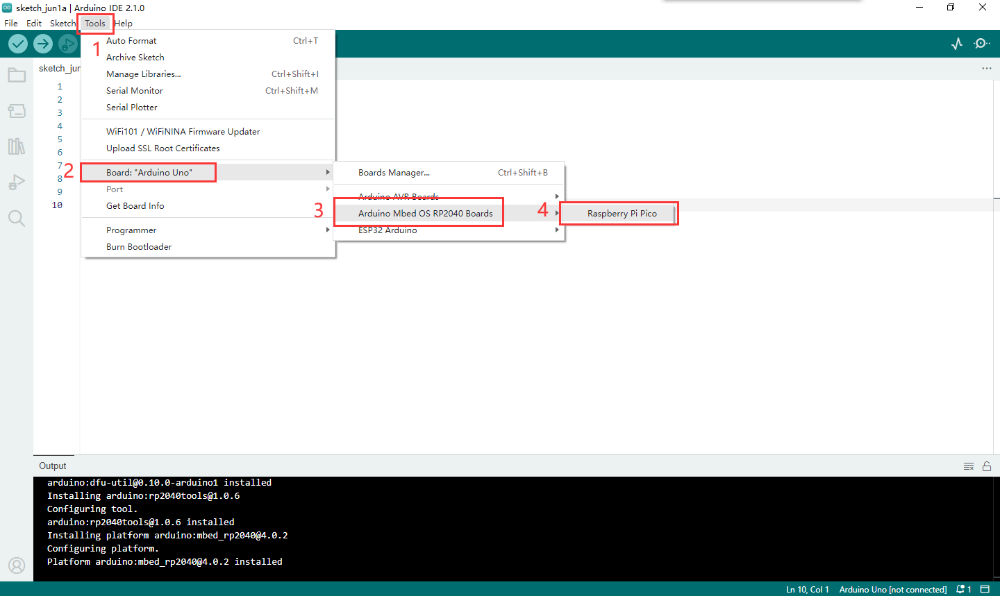

重要步骤：上传与arduino兼容的Pico固件， 否则arduino IDE不能在Pico板上刻录程序。

请参考以下配置:

(1) 断开Raspberry Pi Pico与计算机的连接。按住树莓派Pico上的白色按钮(BOOTSEL)，直到板连接到PC。(一定要记得按住按钮，直到连接完成，否则固件下载失败。)

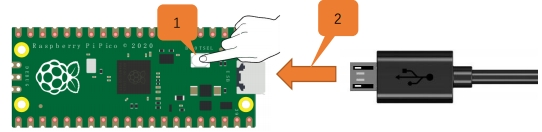 

（2）启动Arduino IDE， 点击文件，示例，01.Basics，Blink

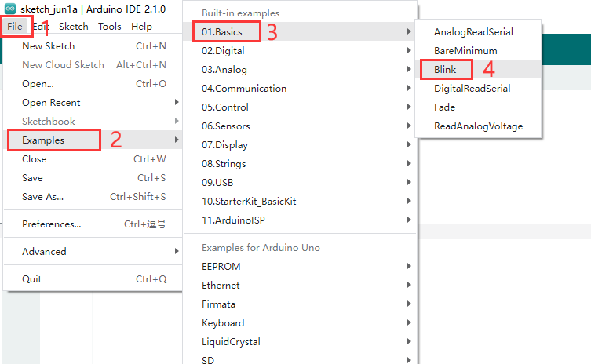 

（3）点击工具，开发板，选择**Arduino Mbed OS RP2040 Boards** 中的 **Raspberry Pi Pico**.

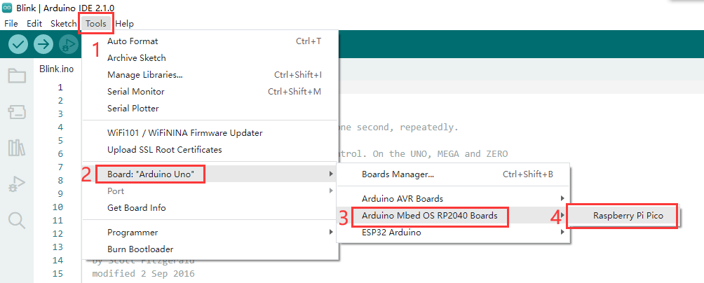 

（4）上传 **Blink** 到Pico板并点击 编译。

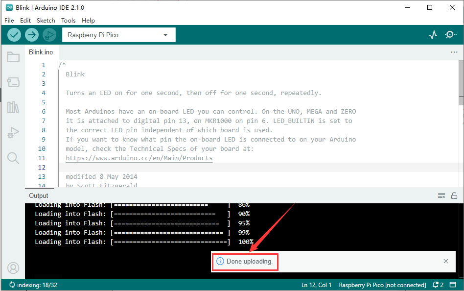 

板上指示灯开始闪烁，间隔为一秒。

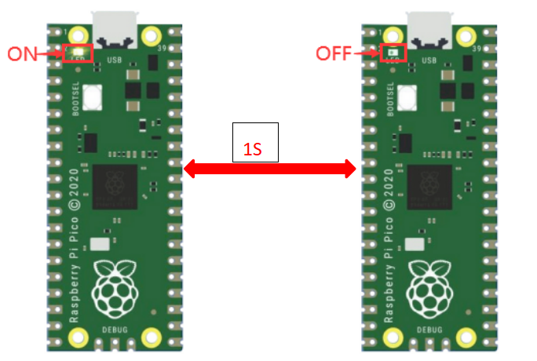

点击工具，串口，选择 **COMx(Raspberry Pi Pico)**.

COMx：每台电脑都会有所不同，此处我们的串口编号是COM25.

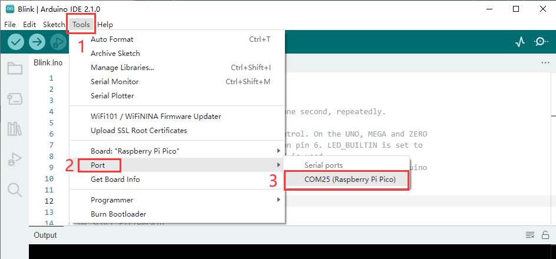

**注意**

* 第一次通过Arduino上传，不需要选择端口。但此后每次都需要检查端口是否选中；否则可能导致下载失败
* 由于固件缺失，Pico板可能无法工作。此时，请重新上传固件

