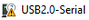

#  **CH340驱动安装--Windows**

下载: [https://fs.keyestudio.com/CH340-WINDOWS](https://fs.keyestudio.com/CH340-WINDOWS)

Windows 10(及以上版本)拥有自己的驱动程序，因此不需要安装额外的驱动程序。

把控制板连接到你的计算机上。

单击计算机-属性-设备管理器，如下所示。这表示连接成功，因此不需要安装驱动程序。

出现以下情况时，需要手动安装驱动程序。

点击 选择“更新驱动”。然后驱动将开始安装。

点击“浏览我的电脑寻找驱动程序”。

找到已下载的文件**usb_ch341_3.1.2009.06**或**cp210x**，单击“下一步”。

安装完成后，关闭窗口显示串口。

驱动安装成功!

点击计算机-属性-设备管理器检查:

