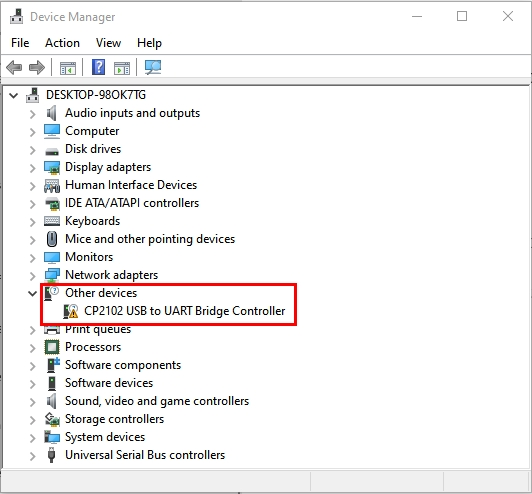
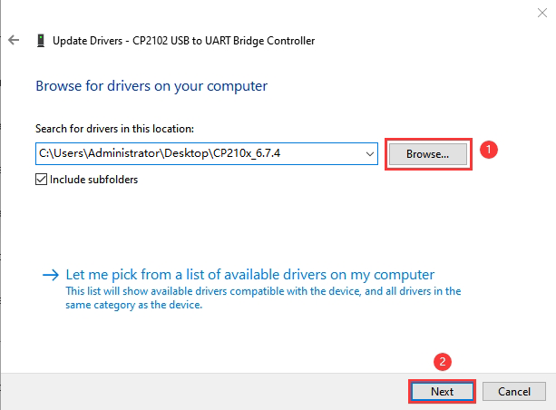

# **CP2102驱动安装--Windows**

下载: [https://fs.keyestudio.com/CP2102-WINDOWS](https://fs.keyestudio.com/CP2102-WINDOWS)

进入网址下载 并解压到 . 

解压得到 ， 请留意该文件夹的路径。

进入“计算机-----属性-----设备管理器”。

页面上的黄色感叹号表示安装不成功，双击选择 “**更新驱动...**”。

点击“**浏览我的电脑寻找驱动程序**”找到下载的Arduino软件。

Arduino软件安装包中有一个DRIVERS文件夹，请打开该文件夹查看CP210X系列芯片的驱动程序。

点击“浏览…，然后搜索CP2102的驱动程序，点击“下一步”。

安装成功。

 

打开设备管理器，黄色感叹号消失，说明CP2102驱动安装成功。

