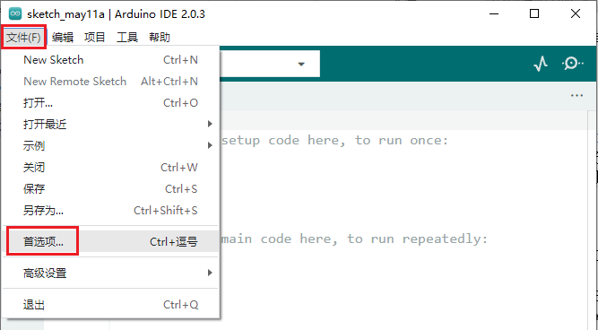
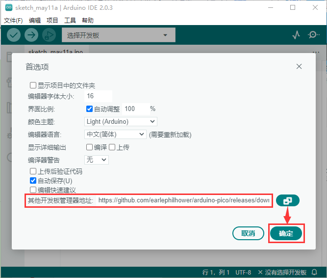
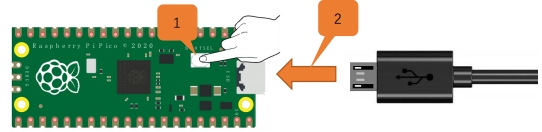
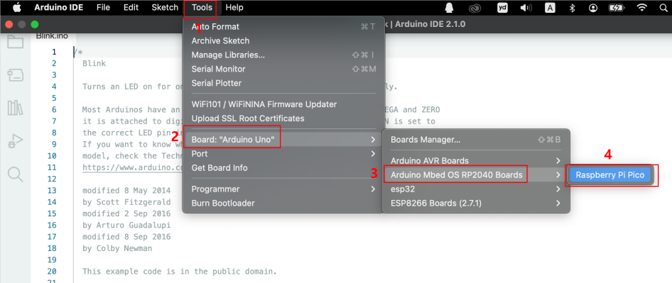

# **树莓派Pico板开发环境配置和安装驱动**

注意：Arduino IDE 软件的下载，安装与设置方法和上面的一样，就不重复说明了。

 
 

(相关资讯：[https://github.com/earlephilhower/arduino-pico](https://github.com/earlephilhower/arduino-pico) )

## **A. Windows系统**

**1. 安装开发板Pico：**

上面已经学习了怎么下载，安装Arduino IDE 软件和怎么安装驱动，那下面就要在Arduino IDE上安装Raspberry Pi Pico，请执行以下步骤：

（1）网络连接良好的情况下，打开Arduino IDE，点击“文件”→“首选项”。

（2）打开下图标出的按钮。

（3）将这个地址：https://github.com/earlephilhower/arduino-pico/releases/download/global/package_rp2040_index.json ，复制粘贴到里面去再点击“**确定**”保存这个地址，如下图：

（4）再点击“**确定**”。

（5）单击“工具”→“开发板”→“开发板管理器...”。

（6）在搜索框中输入“Pico”，选择“**Arduino Mbed OS RP2040 Boards by Arduino**”，点击“**安装**”。

（7）安装过程中，当你收到操作系统的安全警告时，请单击**安装**允许设备软件安装。

（8）安装完成后，单击“工具”→“开发板”，就可以看到刚刚安装的开发板Raspberry Pi Pico。

**2. 安装驱动方法：**

（注意：如果电脑已经安装了驱动程序，则不需要再安装驱动；如果没有，则需要进行以下操作：）

**Windows 10 系统：**

在使用Raspberry Pi Pico主板之前，必须安装驱动程序，否则Raspberry Pi Pico主板将无法与计算机通信。将Raspberry Pi Pico主板用USB线连接到电脑上，一般Windows10系统的电脑会自动识别串口，并安装相应的驱动程序，在设备管理器里可以找到“USB串行设备”。

**Windows 7/8 系统：**

如果你的电脑仍在用Windows7/8操作系统，当把Raspberry Pi Pico主板插到USB口后，电脑会发现一个"**Board CDC**"设备，但不能自动识别它，也无法安装驱动。

Raspberry Pi Pico win7/8系统不能识别端口解决办法如下：

按照下面这个步骤操作，第一次上传后没有出现端口。

打开示例代码后，编译前，要特別注意操作的顺序：

(1) USB线一端连接上电脑上，先断开Raspberry Pi Pico主板与USB线的另一端。

(2) 按住开发板上白色 BOOTSEL 按鍵，然后插上USB线 

(3) 点击Arduino IDE下的上传按钮，进行编译并上传至Raspberry Pi Pico开发板。 

(4) 等到编译“正在编译项目...”，下面提示信息出现上传中“正在上传...”，再松开BOOTSEL按键。

(5) 等待至上传完毕“上传完成”才算完成。

第一次上传过程中一定要注意这个顺序，不然则导致上传失败，后面上传选择对应的“端口”直接点击上传即可。上传完成后，就可以看到Raspberry Pi Pico开发板上的LED在闪烁。

接下来按照下面的操作步骤操作，可以出现串口。

第一步：将Raspberry Pi Pico开发板通过USB线连接到电脑。

第二步：点击下载文件压缩包 [zadig-2.7](zadig-2.7.zip) ，解压压缩包，打开我们提供的软件。

第三步：USB ID 红色框内为2E8A 。  

Driver红色框内为 USB Serial(CDC)，后面的箭头可以选择。

第四步：点击下载，等待下载完毕就成功了，这一步最好关闭杀毒软件。

如果第一次没成功那就拔掉Raspberry Pi Pico板重新再插上，再重新安装一遍。

**3. 上传Arduino兼容的Pico固件：**

如果你的树莓派 Pico 板是新的，想使用Arduino学习和开发，则需要上传一个Adruino兼容的Raspberry Pi Pico固件。请参考以下步骤配置:

（1）断开树莓派 Pico板与电脑的连接。继续按住树莓派 Pico 板上的白色按钮(BOOTSEL)，将树莓派 Pico 板连接到电脑。

等待电脑右下角出现Raspberry Pi Pico板对应的盘(RPI-RP2)，几秒钟之后再松开白色按钮(BOOTSEL)。(注意：盘(RPI-RP2)出现前一定要一直按住白色按钮)

（2）打开Arduino IDE，单击“**工具**”→“**开发板**”，选择开发板Raspberry Pi Pico。

（3）单击 “**文件**”→“**示例**”→“**01.Basics**”→“**Blink**”。

（4）点击上传按钮上传草图（Blink）到树莓派 Pico 板上。

当草图完成上传时，可以看到以下提示。

（5）树莓派 Pico 板上的指示灯开始闪烁。

（6）单击“工具”→“端口”→COMx。COMx的X在不同的电脑上是不同的。请在你的电脑上选择正确的COM口。在这个的例子中，它是COM25。

 

**特别注意:**

 
 

A.每次使用Arduino IDE上传树莓派 Pico 板的代码程序之前，都需要再次选择开发板(Raspberry Pi Pico)和端口(COMx)，否则可能导致代码上传失败。

B.有时在使用时，树莓派 Pico 板可能会由于代码丢失固件而无法工作。此时，你可以如上所述步骤重新操作下上传Raspberry Pi Pico的固件。

## **B. Mac系统：**

通常情况下，我们无法在工具中的开发板中找到Pico板。因为我们还没有在Arduino IDE上安装这个板。

安装步骤：

启动Arduino IDE， 进入:

搜索**Pico**并安装 **Arduino Mbed OS RP2040 Boards**. 

安装完成会有弹出窗口提示。

选择pico板。

重要步骤：上传与arduino兼容的Pico固件， 否则arduino IDE不能在Pico板上刻录程序。

请参考以下配置:

(1) 断开Raspberry Pi Pico与计算机的连接。按住树莓派Pico上的白色按钮(BOOTSEL)，直到板连接到PC。(一定要记得按住按钮，直到连接完成，否则固件下载失败。)

 

（2）启动Arduino IDE， 点击文件，示例，01.Basics，Blink

 

（3）点击工具，开发板，选择**Arduino Mbed OS RP2040 Boards** 中的 **Raspberry Pi Pico**.

 

（4）上传 **Blink** 到Pico板并点击 编译。

 

板上指示灯开始闪烁，间隔为一秒。

（4）点击工具，串口，选择 **/dev/cu.sudmodem14101(Raspberry Pi Pico)**. 

**注意**

* 第一次通过Arduino上传，不需要选择端口。但此后每次都需要检查端口是否选中；否则可能导致下载失败
* 由于固件缺失，Pico板可能无法工作。此时，请重新上传固件

